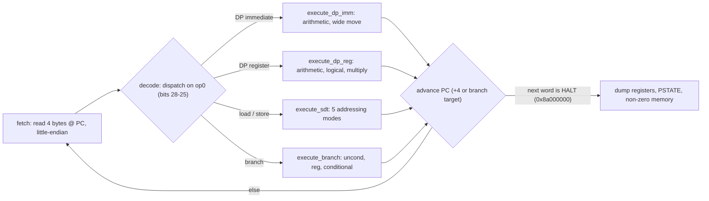
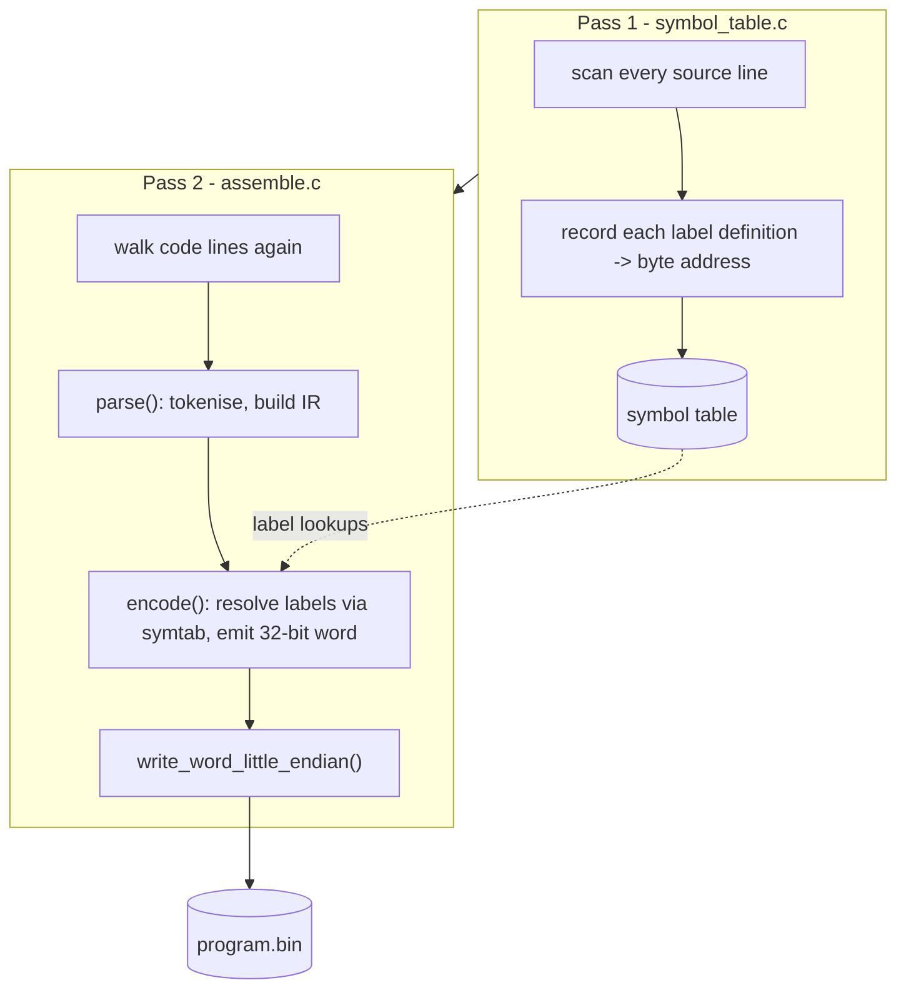
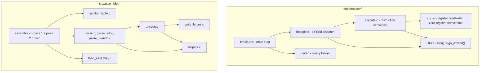

# ARMv8-A Toolchain (Assembler + Emulator)

**C17 · POSIX · Make · No external dependencies**

A from-scratch two-pass assembler and a fetch–decode–execute emulator for a 
subset of the ARMv8-A instruction set, built over a month by
a team of four as a university systems project.

> **Why no source here:** this project was built for a university
> low level C-based project, so the source can't be
> published on GitHub for academic integrity reasons. This page exists
> instead: an architecture writeup for anyone who
> wants to see how it works and how it was built. 

Please do contact me (aaronjacob815@gmail.com) if you want me to walk you through the real source or send it over, I'd love to share!

---

## What it does

Two command-line binaries, built from ~2,400 lines of C17:

| Binary | Input | Output | Job |
|---|---|---|---|
| `assemble` | `program.s` (ARMv8 assembly) | `program.bin` (little-endian machine code binary file) | Two-pass assembler: resolves labels, encodes instructions |
| `emulate` | `program.bin` | Final register/memory states | Fetch–decode–execute loop over a modeled ARMv8 CPU |

The emulator models 31 general-purpose 64-bit registers, a 64-bit PC, the
`N`/`Z`/`C`/`V` PSTATE flags, and 2 MiB of flat memory. Supported instruction
classes: arithmetic, logical, move (wide immediate), multiply, load/store
(five addressing modes), and branches (unconditional, register, conditional).

---

## Emulator: fetch–decode–execute



Decode and execute are strictly separated: **decode only extracts bit
fields**, **execute is the only layer with side effects** on CPU/memory
state. This split kept four people working on different instruction
families in parallel without stepping on each other's code.

---

## Assembler: two-pass pipeline



The intermediate representation (`ir.h`) was a cool datatype: it was a tagged union keyed by
instruction kind (data processing / single data transfer / branching /
directive). Pseudo-instructions (`mov`, `cmp`, `cmn`, `tst`, `neg`, `mul`,
etc.) are rewritten in-place into their canonical encoded form (e.g. `cmp`
becomes `subs` with a discarded destination register), so the encode layer
only ever has to handle "real" instruction shapes.

If encoding fails partway through a file, `atexit(discard_output)` removes
the partially-written binary, so no corrupt `.bin` is ever left on disk.

---

## Module layout



---

## Supported instructions

| Category | Mnemonics |
|---|---|
| Arithmetic | `add`, `adds`, `sub`, `subs`, `cmp`, `cmn`, `neg`, `negs` |
| Logical | `and`, `ands`, `bic`, `bics`, `eor`, `eon`, `orr`, `orn`, `tst`, `mvn` |
| Move | `mov`, `movn`, `movk`, `movz` |
| Multiply | `madd`, `msub`, `mul`, `mneg` |
| Load / store | `ldr`, `str` — unsigned offset, pre-/post-indexed, register offset, PC-relative literal |
| Branch | `b`, `br`, `b.eq`, `b.ne`, `b.ge`, `b.lt`, `b.gt`, `b.le`, `b.al` |
| Directive | `.int` (raw 32-bit word — used to emit the halt instruction and literal data) |

Arithmetic/logical instructions accept an optional shifted second operand
(`lsl`, `lsr`, `asr`, `ror`), e.g. `add x0, x1, x2, lsl #3`.

---

## Sample program

```asm
; count x0 up to 5
movz x0, #0
movz x1, #5
loop:
add x0, x0, #1
subs x2, x1, x0
b.ne loop
.int 0x8a000000   ; halt
```

```bash
./build/assemble loop.s loop.bin
./build/emulate  loop.bin
# → dumps x0 = 0x5, all other registers, PC, PSTATE, and any touched memory
```

---

## Engineering details

- **Language / standard:** C17, compiled with `-Wall -Wextra -Wpedantic`
- **Build system:** a hand-written `Makefile` with automatic dependency
  tracking (`-MMD -MP`), separate `assemble` / `emulate` / `clean` targets
- **Platform:** POSIX (Linux/macOS) — uses `getline`, `strtok_r`, `strdup`
- **Dependencies:** none. No external libraries, just the C standard
  library and POSIX APIs
- **Error handling philosophy:** malformed assembly and out-of-range
  memory access fail fast (`assert`/`exit`) with a clear message rather than
  silently producing wrong output
- **Testing:** validated against a spec-conformance test suite (592 tests
  passing on the emulator alone) plus hand-written integration programs run
  end-to-end through `assemble` → `emulate`

## Project stats

- ~2,400 lines of C across 26 source/header files
- 4-person team, ~300 commits, built primarily during a one-week sprint
- Full codebase with commit history exists in the private repository

## Team

Aaron Jacob, Hussain Waseem, Sebastian Kember, Advit Arora

---

*Recruiters/engineers: happy to share the full private repository or walk
through the source directly — reach out via
[aaronjacob815@gmail.com](mailto:aaronjacob815@gmail.com).*
